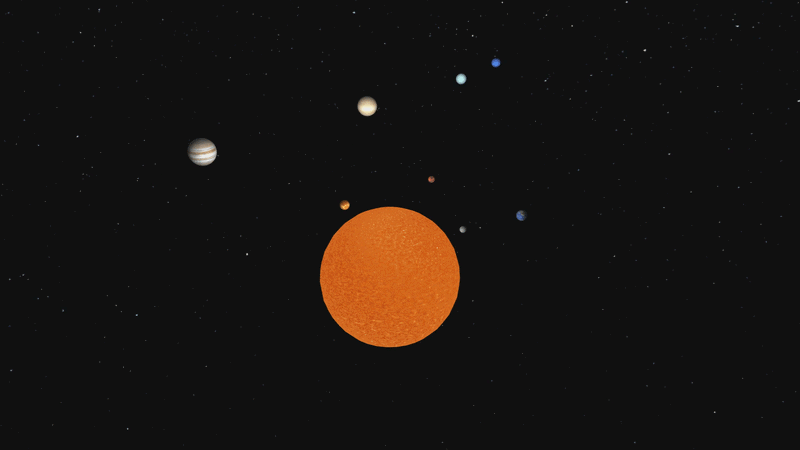

# Solar System Simulation
Starting this project to practice my OpenGL and C/C++ skills. 


;


## Dependencies
- GLAD
- SDL2
- Assimp
- GLM
- stb_image

## Build
Project is written on a GNU/Linux system. You can probably get it running on Windows with relative ease as well, but I'm not willing to be bothered with that. 

You can compile it with this simple command:
```bash
g++ -std=c++17 ./src/* \
-o prog \
-I./include/ \
-I./thirdparty/ \
-I./thirdparty/glm-master/ \
-lSDL2 \
-ldl \
-lassimp
```

And then simply run it by using:
```bash
./prog
```


## Resources I used
- [Solar System Wiki Page](https://en.wikipedia.org/wiki/Solar_System)
- [Make a Scale Solar System](https://www.jpl.nasa.gov/edu/resources/project/make-a-scale-solar-system/)
- [learnopengl.com](https://learnopengl.com/)
- [OpenGL Reference Pages](https://registry.khronos.org/OpenGL-Refpages/gl4/)
- [Solar System Textures](https://www.solarsystemscope.com/textures/)
- [Normal Map Generator](https://smart-page.net/smartnormal/)
- [HDRI to CubeMap convertor](https://matheowis.github.io/HDRI-to-CubeMap/)
- [Perlin Noise](https://en.wikipedia.org/wiki/Perlin_noise)
- [Perlin Noise Shader Code](https://stegu.github.io/webgl-noise/webdemo/)

## Cheklist
Below is the checklist of things I want to implement:

### ~Basics Graphics~
- [x] ~Third-party libraries setup~
- [x] ~Shader abstraction~
- [x] ~Transformations~
- [x] ~Camera movement~
- [x] ~Model loading~

### ~Intermediate Graphics~
- [x] ~Blinn-Phong lighting~
- [x] ~Sun's fragment shader~
- [x] ~Cubemap~
- [x] ~Anti-aliasing~
- [x] ~Normal and depth maps~
- [x] ~Framebuffer for post-processing~

### Advanced Graphics
- [ ] Bloom
- [x] ~Shadows~
- [x] ~HDR~
- [x] ~Gamma handling~
- [ ] SSAO

### Physics
_throwing these out the window, planets differ in size way too much and are way to far away for the project to actually look good_
- ~[ ] Correct planet scaling (possibly smaller Sun to fit the screen)~
- ~[ ] Correct distance between bodies~

_I actually implemeted them by using correct sizes, normalizing to Earth data, and mapping to a logarithmic function prevent large values from being too big_

- [x] ~Planets orbiting around the Sun~
- [ ] Correct time conversion with ability to speed time up

### Chef's Kiss
- [ ] "Photo mode" style UI elements to control post-processing shaders
- [ ] Audio player


